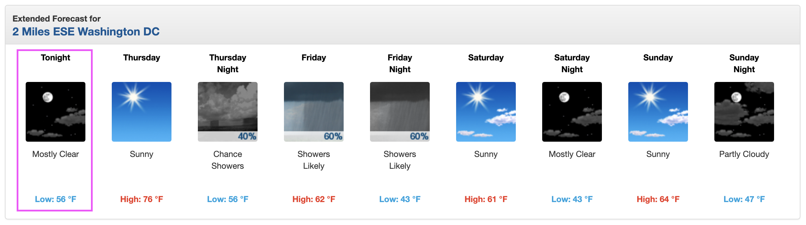

# Module 3 Week 1 Graded Lab directions

### Using pandas

**For this first section, you will only need to use pandas functions. Make sure to `import pandas as pd` first!**

1. Use a pandas's convenience function to grab the table of the host cities for the Olympics from https://en.wikipedia.org/wiki/List_of_Olympic_Games_host_cities as a DataFrame.

2. Use the DataFrame API to complete the following queries.
---
1. What years were the Olympics hosted in 
	- a) the United States? 
	- b) Japan? 
	- c) France?

2. How many times were the Olympics hosted in
	- a) Europe?
	- b) Asia?
	- c) South America?

3. How many times were the Olympics hosted in
- a) the United States before 1990? After 1990?
- b) the United Kingdom before 1990? After 1990?
- c) Italy before 1990? After 1990?
------

### Using BeautifulSoup

**For this second section, you will be using BeautifulSoup against two different HTML files; one you download locally, and one accessed over the Internet. Remember to `from bs4 import BeautifulSoup`.**


3. Use BeautifulSoup to create a soup for the HTML document in `data.html`. (You will need to read in the string from the file, for example using [Python's open function](https://docs.python.org/3/library/functions.html#open).)

4. Select *all* the divs with the `data-item` class.

5. Use a for loop to loop through all of those divs and print out the content of their *one* p tag.

6. Use requests to grab the `text` of the response from the URL "https://forecast.weather.gov/MapClick.php?lat=38.882715000000076&lon=-76.99675499999995#.X4EDD5NKjDI" (should be a string of the HTML document at that URL).

7. Use BeautifulSoup to create a soup with the HTML.

8. Select the *one* element that has id `seven-day-forecast` and assign it to a variable.

9. Visit the URL in your browser window and take a look at the page. You can use your Developer tools in your browser to click around and inspect the HTML. Focus on the part of the page that was just pulled out in item (8) -- the weather forecast. I'e also included a picture below.

Use a for loop to iterate through each panel of the weather forecast. Each panel (one is highlighted in the picture with a pink outline) is identifiable from the class `forecast-tombstone`. In the body of the for loop, print out the interesting text for the weather forecast's period, description, and temperature by printing the text in the selection for each panels' elements matching the `period-name`, `short-desc`, and `temp` classes, respectively. (You can also use the Developer tools or pirnt out the result from item (8) to confirm this structure for yourself, or take it on faith that this is how you can iterate through this HTML.)



10. Copy the code from item (9) above, because we are going to change it just a bit to create a DataFrame from this data. Instantiate an empty list called `data` before your for loop. During the for loop body, create a list of the values you printed out in item (9) above; you could use the variable name `row`. Append the `row` list to the `data` list you created during each for loop iteration. At the end your `data` variable should have a list of lists in the format like so, one inner list for each item in the weather forecast:
```
[["ThisAfternoon", "Mostly Cloudy", "High: 76 °F"],
["Tonight", "Mostly Cloudy", "Low: 62 °F"],
["Sunday", "Chance Rainthen Rain", "High: 72 °F"]]
```
 At the end, use this list of lists to create a DataFrame and show the head of the DataFrame. 
 (See lecture slide 32 for an example of this entire process).